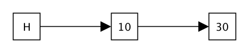
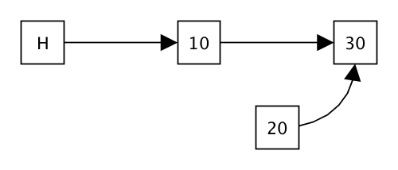
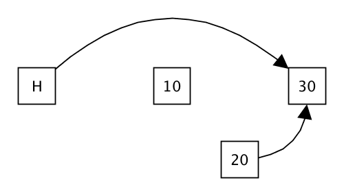
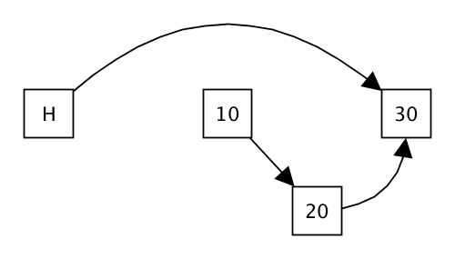

# Lock-free Sorted List

Use the following commands to make a fresh clone of your repository:

```
git clone -b lockfree git@gitlab.epfl.ch:lamp/student-repositories-s22/cs206-GASPAR.git cs206-lockfree
```

## Useful links

  * [The API documentation of the Scala standard library](https://www.scala-lang.org/files/archive/api/2.13.4)
  * [The API documentation of the Java standard library](https://docs.oracle.com/en/java/javase/15/docs/api/index.html)

**If you have issues with the IDE, try [reimporting the
build](https://gitlab.epfl.ch/lamp/cs206/-/blob/master/labs/example-lab.md#ide-features-like-type-on-hover-or-go-to-definition-do-not-work),
if you still have problems, use `compile` in sbt instead.**

## Introduction

The goal of this assignment is to implement a concurrent list that stores values of type `Int` in ascending order.
Last week, we have seen how to use a monitor to make data structures operations behave correctly in a concurrent setting.
This week, the data structure we will implement will not use a monitor or a lock of any kind.
Instead, we will use an atomic operation, called `compareAndSet`, in your implementation of the data structure operations.

The goal will still be to have a data structure that can safely be used in a concurrent setting.
In addition, the sorted list operations you will implement will be *lock-free*.
In a system where all concurrent operations have this property, the progress of at least one thread is ***guaranteed***.
There can not be a global deadlock in which none of the thread can make progress!
Note that this does *not* guarantee that all threads can make progress.
Operation with this property is said to be *wait-free*.

## Atomic Variables

The list methods you will implement will make use of atomic variables. An atomic variable is an object which holds a value of a given type `T`. The object offers two methods to manipulate this value:
- `get`, which returns the current value held in the variable,
- `compareAndSet`, which modifies the content of the variable provided that the previous value is given. This method returns `true` if it was successful, `false` otherwise.

The operation `compareAndSet` applies the following logic ***atomically***, which means there cannot be any context switches between the instructions of the operation:
```scala
def compareAndSet(expected: T, value: T):
    if current == expected then
        current = value
        true
    else
        false
```

The `AtomicVariable` class is given to you. You do not have to worry about implementing it!

Note that a similar class exists in the Java standard library, called [`AtomicReference`](https://docs.oracle.com/javase/8/docs/api/java/util/concurrent/atomic/AtomicReference.html).
The main difference between `AtomicReference` and the `AtomicVariable` class we defined for this exercise is that `AtomicReference` uses referential equality to check whether `expected` and `current` are the same, while `AtomicVariable` uses the `==` method.

## The Sorted List Data Structure

The data structure you will implement is a mutable linked list of integers, sorted in ascending order. Each integer is stored in a `Node`. In addition to the integer value, each node contains a mutable reference to the next node in the list. This mutable reference is held in an `AtomicVariable`.

```scala
abstract class Node(val value: Int, initTail: Option[Node]):

  type State = Option[Node]

  def initialState: State = initTail

  val atomicState: AbstractAtomicVariable[State] = new AtomicVariable[State](initialState)

  def next: Option[Node] = atomicState.get

  // ...
```

Then, `SortedList` is simply a class that holds a reference to the first node of the list. This class is defined in `SortedList.scala`.

```scala
class SortedList extends AbstractSortedList:

  // The sentinel node at the head.
  private val _head = createNode(0, None, isHead=true)

  // The first logical node is referenced by the head.
  def firstNode: Option[Node] = _head.next

  def findNodeWithPrev(pred: Int => Boolean): (Node, Option[Node]) = ???

  def insert(e: Int): Unit = ???

  def contains(e: Int): Boolean = ???

  def delete(e: Int): Boolean = ???
```

The value `_head` of the list is called a [*sentinel* node](https://en.wikipedia.org/wiki/Sentinel_node). This value is simply a `Node` that will serve only as a reference to the first actual node of the list. The value (viz. zero) held by this special node should be completely ignored. This technique is useful because it limits the duplication of code. An alternative would be to have a reference to the first node using an `AtomicVariable`. But this would force us to handle the first node differently from the rest. So we will use a sentinel node for this assignment.

### `findNodeWithPrev`

The first method you will implement is an internal helper method which will be used by all other methods.
This method should do a traversal of the list to find the first node whose value satisfies the parameter predicate.
The method should return the following two values as a pair:
- the predecessor of the node,
- the node.

If `node` is the first node whose value satisfies the predicate and `predecessor` its predecessor, then the method should return `(predecessor, Some(node))`. Due to the use of the sentinel node at the head of the list, the method is bound to find a predecessor, even for the first logical node.

When the predicate doesn't hold on any of the values, then the function should return `(last, None)`, where
`last` is the last node of the list.

### `insert`

Your first goal will be to code the insert method of the lock-free list. The idea is to:

1. Locate the position where you need to insert by using the `findNodeWithPrev` method you have just implemented.
2. Create a new node that holds the value and points to the correct next node. For this, you should use `createNode(value, nextNode)`.
3. Use the `compareAndSet` operation to make the previous node point to your newly created node.
4. If the operation failed, retry from the start! Otherwise, the operation is done!

### `contains`

Next, you should implement the `contains` method, which checks if the list contains a given element. You may of course use the `findNodeWithPrev` method you have implemented.

### `delete`

With the addition of `delete`, things get rapidly trickier. The intuitive solution would be to:

1. Find the node to delete and its predecessor using `findNodeWithPrev`.
2. Use an atomic `compareAndSet` operation to make the predecessor node point to the successor.

Unfortunately, this solution is not entirely satisfactory!
Indeed, there exist schedules in which some successful operations are lost. Can you think of any?

As an example, assume that the list currently contains the values `10` and `30`.



- Imagine one thread starts executing the insertion of `20` in the list and correctly locates where to insert the new node (between `10` and `30`). The thread then creates a node with value `20` and makes it point to the node with value `30`.

  

- Now, some other thread is scheduled and starts executing the deletion of the node with value `10`. The thread finds the two nodes that surround it, that is the sentinel node at the head of the list and the node with value `30` (note that the insertion of `20` by the other thread isn't visible yet!). The thread, using compare and set, changes the next pointer of the sentinel node to the node with value `30`. The `delete` operation then terminates successfully.

  

- Now, the first thread resumes its execution. Its next instruction is to use compare and set to change the next pointer of the node with value `10`, which it can do without any problem! Indeed, this atomic variable wasn't touched by the delete operation. The `insert` operation looks successful, even though the node that was inserted is not reachable from the head of the list! The operation was lost...

  

One solution to this problem, as proposed by Timothy L. Harris in his paper [A Pragmatic Implementation of Non-Blocking Linked Lists](https://www.cl.cam.ac.uk/research/srg/netos/papers/2001-caslists.pdf), is to somehow record in the node that it was deleted.
We will proceed similarly in this assignment.

#### Marking Nodes

The first step is to modify the mutable state held by nodes. Open the `Node.scala` file. Until now the state was just `Option[Node]`, which is an optional reference to the next node.
You will need to add, in addition to this information, a boolean flag that indicates whether the node was deleted or not.


```scala
abstract class Node(val value: Int, initTail: Option[Node]):

  type State = ???

  def initialState: State = ???

  val atomicState: AbstractAtomicVariable[State] = new AtomicVariable[State](initialState)

  def next: Option[Node] = ???

  def deleted: Boolean = ???

  def mark: Boolean = ???
```

Begin by modifying the `State` type to any type that you deem appropriate. Remember that the value of this type should contain an `Option[Node]` (the next node) and a flag (whether the node has been marked).

Complete the other functions, described below, as well:
- `initialState` should return the state of the node when it is first created. Note that the node should not be marked and the optional reference to the next node should be set to `initTail`.
- `next` should return the optional reference to the next node held currently in the state.
- `deleted` should return `true` if the node was marked, `false` otherwise.
- `mark` should mark the node as `deleted`. The method should return `true` only if it is the first time this node is marked. If the node was previously marked, this method should return `false`. (Think carefully about this!)

#### Implementing `delete` of `SortedList`

Now, we can implement a version of delete that is not vulnerable to the problem exposed earlier. The idea is to:

1. Find the node to delete and its predecessor using `findNodeWithPrev`.
2. Mark the node as `deleted` using its `mark` method. If it returns false, retry from the start!

Once this is done, we still have to modify the other list methods to handle the fact that nodes can be marked.
Marked nodes will be deleted within the `findNodeWithPrev` method.

#### Adapting `findNodeWithPrev` to handle marked nodes

The first method you need to adapt is `findNodeWithPrev`. The method should do exactly as before except when it encounters a marked node during its traversal. When it does so, the method should use compare and set to modify the next node pointed by the predecessor node. Regardless of the outcome of the compare and set operation, the `findNodeWithPrev` should then restart from scratch.

#### Adapting `insert` to handle marked nodes

The last method you need to change is `insert`. The logic remains exactly the same, except that when you perform the `compareAndSet` operation, you should make sure that the parameters are of type `State` and are not flagged as deleted.

You are now done with this assignment. Congratulations!
