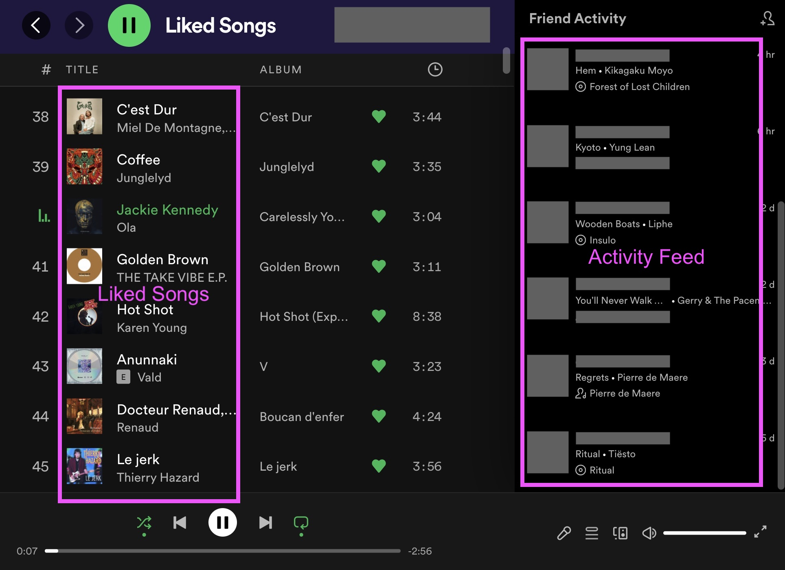

# Problem 4: Implementing Spotify using actors

## Setup

Use the following commands to make a fresh clone of your repository:

```
git clone -b concpar22final04 git@gitlab.epfl.ch:lamp/student-repositories-s22/cs206-GASPAR.git concpar22final04
```

If you have issues with the IDE, try [reimporting the
build](https://gitlab.epfl.ch/lamp/cs206/-/blob/master/labs/example-lab.md#troubleshooting),
if you still have problems, use `compile` in sbt instead.

## Useful Links

- [Akka Classic documentation](https://doc.akka.io/docs/akka/current/index-classic.html), in particular:
    - [Classic Actors](https://doc.akka.io/docs/akka/current/actors.html)
    - [Testing Classic Actors](https://doc.akka.io/docs/akka/current/testing.html)
    - [Classic Logging](https://doc.akka.io/docs/akka/current/logging.html)
- [Akka Classic API reference](https://doc.akka.io/api/akka/current/akka/actor/index.html)
- [CS206 slides](https://gitlab.epfl.ch/lamp/cs206/-/tree/master/slides)

## Overview

In this exercise, you will implement the core functionalities of an online music streaming service. Users will be modelled as individual Akka actors.

- Each user has a unique identifier and a name.
- Each user can like and unlike songs (stored in the user's _liked songs_ list). Liked songs are sorted by reverse date of liking time (the last liked song must be the first element of the list). Elements of this list must be unique: a song can only be liked once. Liking a song twice should not impact the order.
- Each user can subscribe and unsubscribe to other users to see what they are listening to. This is stored in the user's _activity feed_. The items in the activity feed are sorted by reverse date of activity time (the last added activity must be the first element of the list). Items in this list should be unique by user id. If a new activity with a user id that is already in the list is added, the former should be removed, so that we always see the latest activity for each user we have subscribed to.

This corresponds to the core features of Spotify:



Your task is to implement the receive method of the `User` actor. See the enums in the `User` what messages and responses a `User` should handle.

You are allowed to add private methods and attributes to the `User` class. You can also import any Scala collection you might find useful.

To implement the last part (problem 4.4), you will need to interact with the `SongStore` actor passed as the `songStore` parameter. You do not need it for the other parts.

## Problem 4.1: Getting user info (50 points)

Your first task is to implement the `User.receive` method so that it handles the `GetInfo` and `GetHomepageData` messages. This will allow you to pass the first 2 tests.

## Problem 4.2: Updating user info (70 points)

Your second task is to expand `User.receive` so that it handles the `Like` and `Unlike` messages.

## Problem 4.3: Updating user info (70 points)

Your third task is to expand `User.receive` so that it handles the `Subscribe`, `Unsubscribe`, `AddActivity` and `Play` messages.

## Problem 4.4: Displaying the homepage (60 points)

Your last (but not least!) task is to expand `User.receive` so that it handles the `GetHomepageText` message.

A `GetHomepageText` should be answered with `HomepageText` message. Here is an example of a `HomepageText.result`:

```
Howdy Ada!

Liked Songs:
* Sunny by Boney M.
* J'irai où tu iras by Céline Dion & Jean-Jacques Goldman
* Hold the line by TOTO

Activity Feed:
* Bob is listening to Straight Edge by Minor Threat
* Donald is listening to Désenchantée by Mylène Farmer
* Carol is listening to Breakfast in America by Supertramp
```

More precisely, it should contains the following lines in order:

1. `Howdy $name!`, where `$name` is the name of the recipient user.
2. A blank line
3. `Liked Songs:`
4. Zero or more lines listing the user's liked songs. Each of these lines should be of the form `"* ${song.title} by ${song.artist}`, where `${song.title}` is the title of the song and `${song.artist}` its artist.
5. A blank line
6. Zero or more lines listing the user activity feed items. Each of these lines should be of the form `* ${user.name} is listening to ${song.title} by ${song.artist}`, where `${user.name}` is the name of the user listening, `${song.title}` is the title of the song and `${song.artist}` its artist.

In order to fetch the songs information (titles and artists), you should use the `songStore` actor passed as an argument to `User`. See the enums in the `SongsStore` companion object to learn how to interact with the song store.

__Hint 1:__ to construct the result, you might find useful to use [`f-strings`](https://docs.scala-lang.org/overviews/core/string-interpolation.html#the-f-interpolator) and the [`List.mkString`](https://www.scala-lang.org/api/2.13.3/scala/collection/immutable/List.html#mkString(sep:String):String) method. Here is an example of how to use them:

```scala
val fruits = List("Banana", "Apple", "Kiwi")
val result = f"""Fruits:
${fruits.map(fruit => f"* ${fruit}").mkString("\n")}"""

assert(result == """Fruits:
* Banana
* Apple
* Kiwi""")
```

__Hint 2:__ if you need to send the result of a future to an actor, you should use the `pipeTo` method as described in the lectures and [here](https://doc.akka.io/docs/akka/2.5/futures.html#use-the-pipe-pattern).
